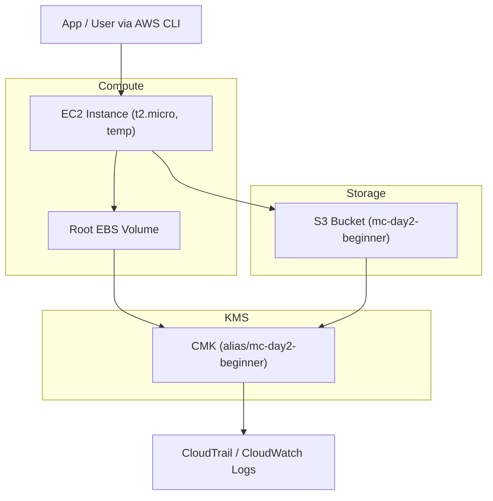

# 🔐 Day 2 — AWS Beginner: S3 & EBS Encryption with KMS  
Multi-Cloud KMS Lab | Region: us-east-1

---

## 🎯 Learning Objectives
- Create and manage a **symmetric CMK** (Customer-Managed Key)
- Encrypt S3 objects using **SSE-KMS**
- Create a snapshot from an EC2 root volume and **copy it encrypted** with your CMK
- Inspect logs with **CloudTrail**
- **Cleanup everything** to avoid billing

---

## 🧠 Concepts Covered
- **AWS KMS CMK** → central key management for S3 and EBS  
- **SSE-KMS** → S3 encryption using your CMK  
- **EBS encryption** → data at rest protection for volumes and snapshots  
- **CloudTrail** → logs every KMS key operation

---

## 🧭 Architecture Overview

🧩 Flow summary: Data flows from user to EC2 and S3; both resources encrypt with the same CMK; CloudTrail records all operations.

⚙️ Hands-On Steps
1️⃣ Create a KMS key
aws kms create-key --description "mc-day2-beginner" --region us-east-1
aws kms create-alias --alias-name alias/mc-day2-beginner --target-key-id <key-id>

2️⃣ Create an S3 bucket and enable SSE-KMS
aws s3api create-bucket --bucket mc-day2-s3 --region us-east-1
aws s3api put-bucket-encryption --bucket mc-day2-s3 \
  --server-side-encryption-configuration '{"Rules":[{"ApplyServerSideEncryptionByDefault":{"SSEAlgorithm":"aws:kms","KMSMasterKeyID":"<key-id>"}}]}'

3️⃣ Launch an EC2 instance with EBS encryption
aws ec2 run-instances --image-id ami-xxxxxxxx --instance-type t2.micro \
  --block-device-mappings DeviceName=/dev/xvda,Ebs={Encrypted=true,KmsKeyId=<key-id>} \
  --region us-east-1

4️⃣ Verify CloudTrail logs
aws cloudtrail lookup-events --lookup-attributes AttributeKey=EventName,AttributeValue=Encrypt

✅ Outcome

You’ve encrypted data at rest for S3 and EBS using one CMK and validated key usage with CloudTrail.

⬅ Back to Course Overview
