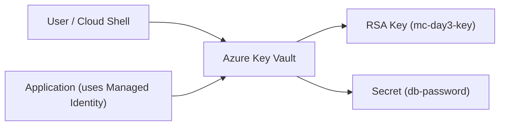

# ☁️ Azure Day 3 — Beginner Lab: Key Vault Fundamentals

### 🎯 Goal  
Learn how to create an **Azure Key Vault**, store a key and secret, and use them for encryption and decryption.

---

## 🧠 Concepts Covered
- **Key Vault Keys** — store RSA or EC keys for encryption/decryption.
- **Key Vault Secrets** — securely store passwords and connection strings.
- **Managed Identity (UAMI)** — authenticate to Key Vault without credentials.
- **Azure CLI** — manage keys, secrets, and access policies.

---

📊 Diagram


## ⚙️ Hands-On Steps

### 1️⃣ Create a Resource Group
```bash
az group create --name mc-day3-rg --location eastus

2️⃣ Create a Key Vault
az keyvault create --name mc-day3-kv --resource-group mc-day3-rg --location eastus

3️⃣ Create a Key
az keyvault key create --vault-name mc-day3-kv --name mc-day3-key --protection software

4️⃣ Create a Secret
az keyvault secret set --vault-name mc-day3-kv --name db-password --value "MyP@ssword123"

---

✅ Outcome

By the end of this lab, you will:

Understand how to create and manage an Azure Key Vault.

Store and retrieve both keys and secrets securely.

Authenticate to Key Vault without credentials using a Managed Identity.
