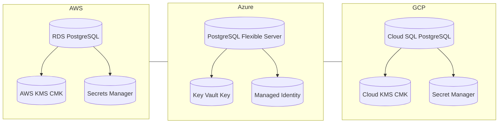

# 🌍 Day 5 — Databases & Secrets Encryption (Multi-Cloud)

> **Objective:** Learn how databases across AWS, Azure, and GCP use **Customer-Managed Keys (CMK)** and **Secret Managers** for secure, compliant storage.

---

## 📊 Progress Overview

| Cloud | Service | Encryption | Status | Link |
|:------|:---------|:------------|:-------|:------|
|  | **RDS PostgreSQL + Secrets Manager** | 🔐 KMS CMK | ✅ Completed | [View AWS Lab](../../aws/day5-databases/README.md) |
|  | **PostgreSQL Flexible Server + Key Vault** | 🔐 CMK + MI | ✅ Completed | [View Azure Lab](../../azure/day5/README.md) |
|  | **Cloud SQL PostgreSQL + Cloud KMS** | 🔐 CMEK | ⏳ Pending | [View GCP Lab](../../gcp/day5/README.md) |

---

## 🧠 Learning Goals
- Understand **database-level encryption** with Customer-Managed Keys (CMK)
- Implement **key rotation** and **role-based access**
- Store secrets securely with **AWS Secrets Manager**, **Azure Key Vault**, or **GCP Secret Manager**
- Automate provisioning and teardown via **Terraform**, **CloudFormation**, or **ARM**

---

## 🧱 Architecture Overview

🧩 Lab Directories
Folder	Purpose
aws/day5/	AWS RDS PostgreSQL encrypted with AWS KMS
azure/day5/	Azure PostgreSQL Flexible Server encrypted with Key Vault CMK
gcp/day5/	GCP Cloud SQL PostgreSQL encrypted with Cloud KMS CMEK
common/day5-databases/	Shared docs, notes, and comparisons

✅ Cleanup Policy
Always destroy the lab after completion to avoid billing:

bash
Copy code
terraform destroy -auto-approve
Next Step:
➡ Once GCP Day 5 is complete, we’ll add the final badge and link for full completion.
