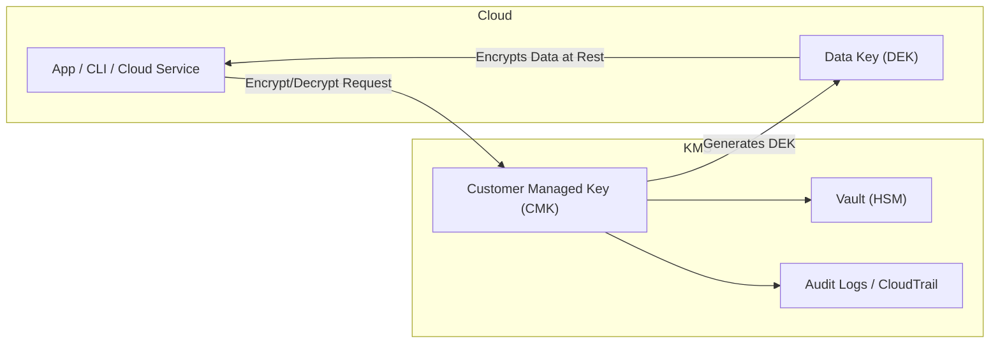

# 🏁 Day 1 — Cloud KMS Foundations  
Multi-Cloud KMS Lab | AWS • Azure • GCP

---

## 🎯 Learning Objectives
By the end of Day 1, you will be able to:
✅ Explain the difference between **symmetric** and **asymmetric** keys  
✅ Describe **Envelope Encryption** using real-world analogy  
✅ Identify **where** keys live and **how** apps use them  
✅ Show **basic KMS usage** from AWS, Azure & GCP CLIs  

---

## 📌 Key Concept — What is KMS?

KMS is the **vault** inside a high-security building.  
Applications never carry the **master key**; they **request encryption services** from the vault.

| Role | What it means |
|------|---------------|
| 🔐 Customer Managed Key (CMK) | You own control and policies |
| 🏦 HSM-backed storage | No keys ever leave the vault |
| 📜 IAM-linked access | The vault checks identity before unlocking |
| 📊 Full auditing | Every use of keys is logged |

> If KMS says **NO** → Encryption stops.  
> If KMS key is disabled → **Everything encrypted becomes unreadable.**

---

## 🔐 Envelope Encryption — Analogy

🪙 *Data is a coin*  
🔑 *Data-Key is the lock for the coin*  
🏦 *KMS Master Key protects the Data-Key*

Coin (Data) + 🔒 (Data-Key encrypted by 🔐 Master Key)

yaml
Copy code

Even if attackers grab the coin box — they **cannot unlock it** without KMS.

---

## 🔁 Envelope Encryption (Diagram)

🧩 Flow Summary
1️⃣ The app or CLI calls KMS to encrypt/decrypt.
2️⃣ KMS uses the Customer Managed Key (CMK) in an HSM vault to produce or unwrap a Data Key (DEK).
3️⃣ The DEK encrypts application data (e.g., S3, Azure Blob, GCS).
4️⃣ All actions are logged in CloudTrail / Audit Logs.

🔥 Data Keys only live in memory for milliseconds
Never stored. Never logged.

🧪 Cross-Cloud Quick Check
Run these in your terminal:

bash
Copy code
aws kms list-keys --region us-east-1
az keyvault list --output table
gcloud kms keyrings list --location us-central1
✅ If all 3 command lines return results — Day 1 Verified!

🧠 Best Practices (Real Industry Rules)
Strategy	Why it matters
✅ Least-privilege on IAM	Prevent accidental key abuse
✅ Enable logging first	Forensics + Compliance
✅ Avoid key exposure	KMS does encryption for you
✅ Rotate keys on schedule	Prevent long-term compromise

🧹 Cleanup
Nothing to delete today — no KMS keys were created 🙌

📝 Quick Quiz — Self Check
✓ What is the point of Envelope Encryption?
✓ What happens if a KMS key is disabled?
✓ Why is IAM tied to KMS usage?
