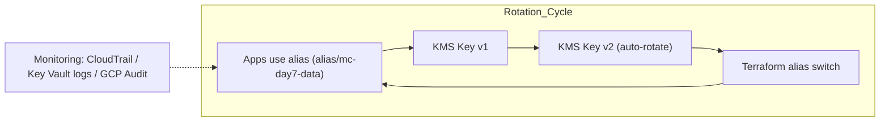

# Day 7 – Rotation Automation (Terraform)

> **Strategy:** Rotate keys safely, update aliases, and keep apps unaware.

Patterns

AWS: enable_key_rotation = true (annual for symmetric keys) + alias pattern for manual rotation.

Azure: key rotation policy (schedules) + auto-rotate action.

GCP: rotation_period (platform sets nextRotationTime automatically).

Why aliasing? The alias stays stable while the backing key rotates (auto) or is swapped (manual). Apps never need to change configs.

yaml
Copy code

🧭 Goal

Establish automated key-rotation policies across AWS KMS, Azure Key Vault, and GCP Cloud KMS, ensuring that:

All encryption keys rotate within defined compliance cycles (e.g. 90 / 180 / 365 days).

Applications remain unaware of rotations because they use stable aliases.

All rotation and access events are logged centrally for audits.

⚙️ Core Concepts
Concept	Description
Key Versioning	Each rotation produces a new key version while the old version remains for decryption.
Alias Indirection	Apps use aliases (e.g. alias/mc-day7-data) rather than raw Key IDs; the alias simply points to the newest version.
Rotation Policy	Defines rotation intervals (e.g. 90 days) and triggers (auto or manual).
Audit Trail	Every rotation event is written to the provider’s audit log (CloudTrail / Key Vault / GCP Audit).
🧩 Terraform Highlights

🧮 Validation Checks
Cloud	CLI Command	Expected Result
AWS	aws kms get-key-rotation-status --key-id alias/mc-day7-data	"KeyRotationEnabled": true
Azure	az keyvault key rotation-policy show --vault-name <vault> --name mc-day7-key	Shows Rotate + Notify actions
GCP	gcloud kms keys describe mc-day7-key --keyring mc-day7-ring --format='json(rotationPeriod,nextRotationTime)'	Displays rotationPeriod + nextRotationTime
📊 Monitoring and Audit Pipeline

AWS: CloudTrail → EventBridge → SNS Alert (RotateKey events).

Azure: Key Vault Diagnostics → Log Analytics → Alert Rule.

GCP: Cloud Audit Logs → Cloud Monitoring → Email or Slack notifier.

📘 Best Practices

Keep rotation intervals consistent (align Azure and GCP to AWS annual standard if possible).

Store rotation metadata in Terraform state or an external Secrets manager.

Never hard-code Key IDs in apps — use aliases or environment variables.

Combine auto rotation with manual alias swaps for testing fallback procedures.

Regularly audit IAM permissions to ensure only CICD and security accounts can rotate keys.

🧹 Cleanup
# Optional clean-up when testing:
terraform destroy -auto-approve

Keys with pending deletion retain encrypted data until the retention window expires (7–30 days depending on provider).
