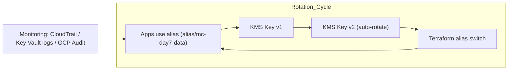

# Day 7 – Rotation Automation (Terraform)

> **Strategy:** Rotate keys safely, update aliases, and keep apps unaware.

Patterns

AWS: enable_key_rotation = true (annual for symmetric keys) + alias pattern for manual rotation.

Azure: key rotation policy (schedules) + auto-rotate action.

GCP: rotation_period (platform sets nextRotationTime automatically).

Why aliasing? The alias stays stable while the backing key rotates (auto) or is swapped (manual). Apps never need to change configs.

yaml
Copy code
