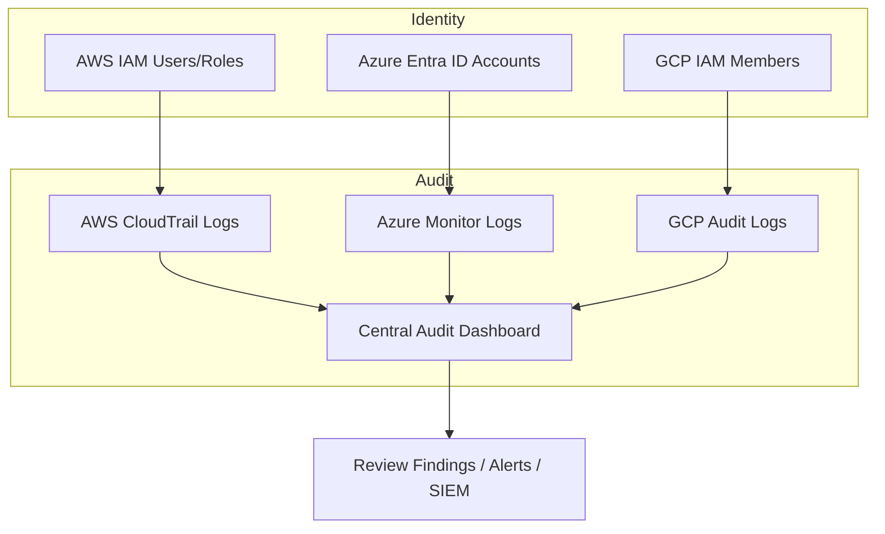
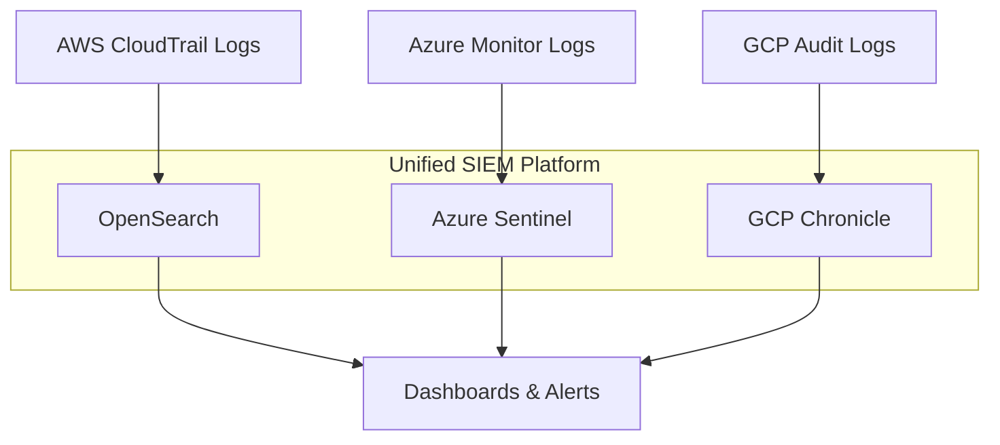

# 🌍 Day 8 — Identity and Access Control (IAM Across Clouds)

## 🎯 Goal
Learn how AWS KMS, Azure Key Vault, and Google Cloud KMS integrate with IAM identities, and how to audit their usage with CloudTrail, Azure Monitor, and Cloud Audit Logs.

---

## 💡 Concept

Each cloud logs every KMS key operation (Encrypt, Decrypt, ReEncrypt, GenerateDataKey, etc.) through its native audit system.  
This lab shows you how to query those logs and visualize cross-cloud activity from IAM users, roles, and services.

---

## 🧩 Learning Objectives
By the end of this lab, you will:
- Configure IAM principals for each cloud.
- Apply least-privilege access to encryption keys.
- Enable key access auditing in AWS, Azure, and GCP.
- Aggregate logs into a unified compliance view.

---

## 🗝️ IAM Access Overview
| Cloud | Identity Type | Access Mechanism | Key Scope | Example Action |
|:--|:--|:--|:--|:--|
| **AWS** | IAM User / Role | Key Policy + Grant | CMK | `kms:Encrypt`, `kms:Decrypt` |
| **Azure** | Managed Identity / Service Principal | RBAC / Access Policy | Key Vault Key | `Microsoft.KeyVault/keys/decrypt/action` |
| **GCP** | Service Account | IAM Binding + Role | CryptoKey | `cloudkms.cryptoKeyVersions.useToDecrypt` |

---

## 🧭 Diagram — Cross-Cloud IAM Control Flow

---

🪣 Hands-On Steps
1️⃣ AWS: View Key Usage in CloudTrail
aws cloudtrail lookup-events \
  --lookup-attributes AttributeKey=EventName
,AttributeValue=Encrypt \
  --region us-east-1 \
  --query 'Events[0:5].[EventTime,Username,EventName,Resources]'

2️⃣ Azure: Query KMS Access from Log Analytics
AzureDiagnostics
 | where ResourceProvider == "MICROSOFT.KEYVAULT"
 | where OperationName contains "Encrypt" or OperationName contains "Decrypt"
 | project TimeGenerated, Identity, OperationName, ResultType
 | top 10 by TimeGenerated desc

3️⃣ GCP: List KMS Access in Audit Logs
gcloud logging read \
  'protoPayload.serviceName="cloudkms.googleapis.com" AND protoPayload.methodName:"Decrypt"' \
  --limit=10 \
  --format="table(timestamp, protoPayload.authenticationInfo.principalEmail, protoPayload.methodName)"

4️⃣ (Optional) Aggregate Logs Cross-Cloud

Push all three sources into a central log store (SIEM or OpenSearch) with tags:

mc-lab=kms-day8  environment=dev  source=aws|azure|gcp

📈 Outcome

By the end of this lab you’ll be able to:

View who used which key and when in each cloud.

Detect unauthorized or unusual access patterns.

Centralize logs for cross-cloud KMS security monitoring.

🧹 Cleanup

Disable any temporary log streams or storage buckets created for this lab to avoid ongoing charges.

✅ End of Day 8 – Identity & Audit

🧠 Optional Extension — SIEM Integration (Unified Visibility)

Modern enterprises centralize multi-cloud audit events in a Security Information and Event Management (SIEM) platform such as:

AWS OpenSearch / ELK Stack

Azure Sentinel

GCP Chronicle

Splunk / Datadog / Grafana Loki

This section extends your Day 8 lab to send logs from AWS CloudTrail, Azure Monitor, and GCP Audit Logs to a unified dashboard.

☁️ AWS → OpenSearch (CloudTrail Ingestion)

Create an S3 destination for your CloudTrail logs:

aws s3 mb s3://mc-day8-audit-logs

Configure Kinesis Firehose to deliver CloudTrail events into OpenSearch:

aws firehose create-delivery-stream \
  --delivery-stream-name mc-day8-cloudtrail-stream \
  --delivery-stream-type DirectPut \
  --elasticsearch-destination-configuration \
      IndexName="cloudtrail", \
      RoleARN="arn:aws:iam::<account-id>:role/FirehoseToOpenSearchRole"

View in OpenSearch:

Index name: cloudtrail-*

Filter by: eventSource:"kms.amazonaws.com"

🟦 Azure → Sentinel (Log Analytics Workspace)

Connect Key Vault diagnostics to Log Analytics:

az monitor diagnostic-settings create \
  --name "kv-logs-to-law" \
  --resource <key-vault-id> \
  --workspace <log-analytics-id> \
  --logs '[{"category":"AuditEvent","enabled":true}]'

In Azure Sentinel, create a workbook:

AzureDiagnostics
| where ResourceProvider == "MICROSOFT.KEYVAULT"
| where OperationName has_any ("Encrypt","Decrypt")
| summarize count() by bin(TimeGenerated, 1h), Identity

🟨 GCP → Cloud Logging / BigQuery / SIEM Export

Create a sink for Audit Logs:

gcloud logging sinks create mc-day8-sink \
    "pubsub.googleapis.com/projects/<project-id>/topics/mc-day8-topic" \
    --log-filter='protoPayload.serviceName="cloudkms.googleapis.com"'

Stream to BigQuery or SIEM:

Destination: BigQuery dataset (kms_audit)

Optional: Use Dataflow or Pub/Sub → Splunk / Elastic connector

Query sample:

SELECT
  timestamp,
  protoPayload.authenticationInfo.principalEmail AS actor,
  protoPayload.methodName AS operation
FROM `kms_audit.cloudaudit_googleapis_com_data_access`
ORDER BY timestamp DESC
LIMIT 20;

🌐 Visualization Layout

---

✅ Outcome

By completing this optional extension, you can:

Centralize KMS access logs across all clouds.

Correlate key activity per user, key alias, or resource.

Build visual dashboards showing encryption/decryption operations.

Automate anomaly detection (e.g., sudden increase in Decrypt events).

📘 Next Step

Continue to Day 9 – Governance & Monitoring, where we’ll connect audit patterns to policy enforcement and alerts.
