# 🌍 Day 8 — Identity and Access Control (IAM Across Clouds)

## 🎯 Goal
Learn how AWS KMS, Azure Key Vault, and Google Cloud KMS integrate with IAM identities, and how to audit their usage with CloudTrail, Azure Monitor, and Cloud Audit Logs.

---

## 🧩 Learning Objectives
By the end of this lab, you will:
- Configure IAM principals for each cloud.
- Apply least-privilege access to encryption keys.
- Enable key access auditing in AWS, Azure, and GCP.
- Aggregate logs into a unified compliance view.

---

## 🗝️ IAM Access Overview
| Cloud | Identity Type | Access Mechanism | Key Scope | Example Action |
|:--|:--|:--|:--|:--|
| **AWS** | IAM User / Role | Key Policy + Grant | CMK | `kms:Encrypt`, `kms:Decrypt` |
| **Azure** | Managed Identity / Service Principal | RBAC / Access Policy | Key Vault Key | `Microsoft.KeyVault/keys/decrypt/action` |
| **GCP** | Service Account | IAM Binding + Role | CryptoKey | `cloudkms.cryptoKeyVersions.useToDecrypt` |

---

## 🧭 Diagram — Cross-Cloud IAM Control Flow

```mermaid
flowchart LR
    subgraph AWS["AWS KMS + IAM Role"]
        A[App / Lambda] --> B[IAM Role → Key Policy → KMS Key]
    end
    subgraph Azure["Azure Key Vault + RBAC"]
        C[VM / Function] --> D[Managed Identity → Access Policy]
    end
    subgraph GCP["GCP KMS + IAM Binding"]
        E[Service / VM] --> F[Service Account → IAM Role → CryptoKey]
    end
    A -.Federation.-> C
    C -.Multi-Cloud Audit.-> E
```


---

## 🔍 IAM Audit & Monitoring

### 🟦 AWS — CloudTrail + CloudWatch Logs
```bash
aws cloudtrail create-trail --name kms-trail --s3-bucket-name mc-lab-audit
aws cloudtrail start-logging --name kms-trail
aws logs create-log-group --log-group-name /mc-lab/kms
aws logs create-log-stream --log-group-name /mc-lab/kms --log-stream-name kms-events
View logs in CloudWatch Insights:

sql
Copy code
fields @timestamp, eventSource, eventName, userIdentity.arn
| filter eventSource="kms.amazonaws.com"
| stats count() by eventName, userIdentity.arn
🟩 Azure — Monitor + Key Vault Diagnostics
bash
Copy code
az monitor diagnostic-settings create \
  --name "kv-logs" \
  --resource $(az keyvault show -n mc-day8-vault --query id -o tsv) \
  --workspace $(az monitor log-analytics workspace show -g rg -n mc-law --query id -o tsv) \
  --logs '[{"category":"AuditEvent","enabled":true}]'
Query with Kusto:

kusto
Copy code
AzureDiagnostics
| where Category == "AuditEvent" and OperationName contains "Decrypt"
| summarize count() by CallerIPAddress, ResultDescription
🟥 GCP — Cloud Audit Logs + Log Explorer
bash
Copy code
gcloud logging sinks create kms-sink storage.googleapis.com/mc-lab-audit-bucket \
  --log-filter='resource.type="cloudkms_cryptokey"'
Example query:

bash
Copy code
resource.type="cloudkms_cryptokey"
protoPayload.methodName="Decrypt"
📊 Compliance Aggregation (Optional)
Export all logs to a central S3 / Blob / GCS bucket.

Use Athena, Sentinel, or BigQuery to join them.

Normalize fields (principal, action, timestamp) for unified reports.

✅ Outcome
You can now:

Configure cross-cloud IAM access to KMS keys.

Audit key usage events and detect anomalies.

Build a unified governance dashboard.
