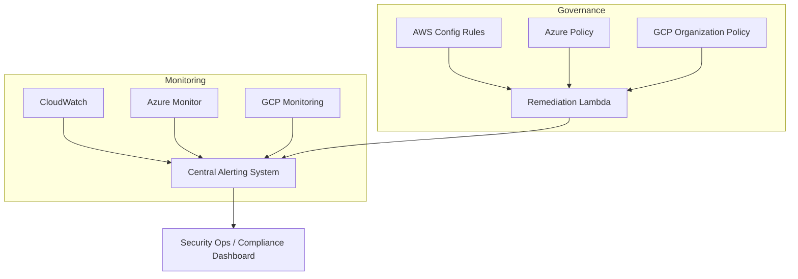

# 🏛️ Day 9 — Governance & Monitoring (Multi-Cloud)

**Goal:**  
Implement guardrails, compliance policies, and monitoring to ensure that encryption keys and access logs across AWS, Azure, and GCP remain secure, compliant, and auditable.

---

## 💡 Concept

Governance defines *who can do what* with your encryption keys, while Monitoring ensures that *any deviation* is detected and reported.  
This lab introduces cloud-native policy enforcement and alerting mechanisms:

| Cloud | Governance Service | Monitoring & Alerting |
|:------|:-------------------|:----------------------|
| AWS | AWS Config Rules / Security Hub | CloudWatch Alarms / GuardDuty |
| Azure | Azure Policy / Defender for Cloud | Monitor Alerts / Sentinel |
| GCP | Organization Policy Constraints | Cloud Monitoring / Security Command Center |

---

## 🧠 Architecture Diagram

---

⚙️ Hands-On Steps
1️⃣ AWS Config — Detect Unencrypted Volumes
bash
Copy code
aws configservice put-config-rule \
  --config-rule-name "encrypted-volumes" \
  --source Owner=AWS,SourceIdentifier=ENCRYPTED_VOLUMES
2️⃣ Azure Policy — Enforce Key Vault CMEK
bash
Copy code
az policy definition create \
  --name "kv-require-cmek" \
  --display-name "Key Vaults must use customer-managed keys" \
  --rules kv-policy.json \
  --mode All
3️⃣ GCP Organization Policy — Restrict KMS Regions
bash
Copy code
gcloud org-policies set-policy restrict-kms-region.yaml \
  --organization=<ORG_ID>
4️⃣ Alert on Key Misuse (Example Cross-Cloud Metric)
Platform	Metric	Condition	Action
AWS	kms:Decrypt count	> 20 / hour	SNS Notification
Azure	KeyVaultAuditEvents	Unauthorized access	Logic App Trigger
GCP	cloudkms.googleapis.com/decrypt_count	Spike > threshold	Pub/Sub Alert

📈 Outcome
By completing this lab you will:

Define compliance policies across all clouds.

Monitor and alert on key misconfigurations or overuse.

Prepare the foundation for Day 10 – Incident Response.

🧹 Cleanup
Disable or delete any temporary Config Rules, Policies, and Alerts to avoid extra costs.

✅ End of Day 9 – Governance & Monitoring
