# 🌍 GCP Day 4 — Beginner Lab: Cloud KMS Fundamentals

### 🎯 Goal  
Understand how to create and use **Google Cloud Key Management Service (KMS)** keys for basic encryption and decryption.

---

### 🧠 Concepts Covered
- **Key Rings & Keys** — group keys logically for environment separation.
- **IAM Roles** — control who can use or manage keys.
- **Cloud Shell / gcloud CLI** — manage keys and encrypt data.
- **Audit Logging** — visibility into key access and cryptographic operations.

---

### 📊 Diagram

```mermaid
flowchart LR
    A["App / Cloud Shell User"]
    B["Key Ring (day4-ring)"]
    C["Crypto Key (day4-key, Symmetric)"]
    D["Encrypt Data (sample.txt → sample.enc)"]
    E["Decrypt Data (sample.enc → decrypted.txt)"]

    A --> B
    B --> C
    C --> D
    D --> E
    E --> A
```


Tagging: mc-lab=kms-day4 (labels/annotations where applicable)

## 🧰 Hands-On Steps

### 1️⃣ Create a Key Ring
```bash
gcloud kms keyrings create day4-ring --location=us-central1
2️⃣ Create a Symmetric Key
bash
Copy code
gcloud kms keys create day4-key \
  --keyring=day4-ring \
  --location=us-central1 \
  --purpose=encryption
3️⃣ Encrypt a Sample File
bash
Copy code
echo "Hello GCP KMS Beginner!" > sample.txt
gcloud kms encrypt \
  --key day4-key --keyring=day4-ring \
  --location=us-central1 \
  --plaintext-file sample.txt \
  --ciphertext-file sample.enc
4️⃣ Decrypt the File
bash
Copy code
gcloud kms decrypt \
  --key day4-key --keyring=day4-ring \
  --location=us-central1 \
  --ciphertext-file sample.enc \
  --plaintext-file decrypted.txt
cat decrypted.txt

🔐 IAM & Access Control
Role	Description	Example
roles/cloudkms.admin	Manage key rings and keys	Used by admins for creation/deletion
roles/cloudkms.cryptoKeyEncrypterDecrypter	Encrypt/decrypt using a key	Used by applications or service accounts
roles/viewer	View key metadata only	Used by auditors or compliance reviewers

Check permissions:

gcloud projects get-iam-policy $DEVS_PROJECT_ID \
  --flatten="bindings[].members" \
  --format='table(bindings.role, bindings.members)'

🪶 Enabling Audit Logs

Enable Admin Read and Data Access logs for KMS in your project settings.
This ensures every encryption/decryption event appears in Cloud Logging.

To view logs:

gcloud logging read 'resource.type="kms_keyring"'

🧹 Cleanup
gcloud kms keys disable day4-key --keyring=day4-ring --location=us-central1
gcloud kms keyrings delete day4-ring --location=us-central1

✅ Outcome

By the end of this lab, you will:

Understand how GCP KMS manages keys and permissions.

Encrypt and decrypt data with your own symmetric key.

Explore IAM roles and audit logs for visibility.

Know how to clean up unused KMS resources safely.

