# 🌍 GCP Day 4 — Beginner Lab: Cloud KMS Fundamentals

### 🎯 Goal  
Understand how to create and use **Google Cloud Key Management Service (KMS)** keys for basic encryption and decryption.

---

### 🧠 Concepts Covered
- **Key Rings & Keys** — group keys logically for environment separation.
- **IAM Roles** — control who can use or manage keys.
- **Cloud Shell / gcloud CLI** — manage keys and encrypt data.

---

### 📊 Diagram

```mermaid
flowchart LR
    A["App / Cloud Shell User"]
    B["Key Ring (day4-ring)"]
    C["Crypto Key (day4-key, Symmetric)"]
    D["Encrypt Data (sample.txt → sample.enc)"]
    E["Decrypt Data (sample.enc → decrypted.txt)"]

    A --> B
    B --> C
    C --> D
    D --> E
    E --> A
```

Tagging: mc-lab=kms-day4 (labels/annotations where applicable)

🧹 Cleanup
gcloud kms keys disable day4-key --keyring=day4-ring --location=us-central1
gcloud kms keyrings delete day4-ring --location=us-central1

✅ Outcome

By the end of this lab, you will:

Understand how GCP KMS manages keys.

Be able to encrypt/decrypt data using your own symmetric key.

Know how to clean up to avoid resource costs.

