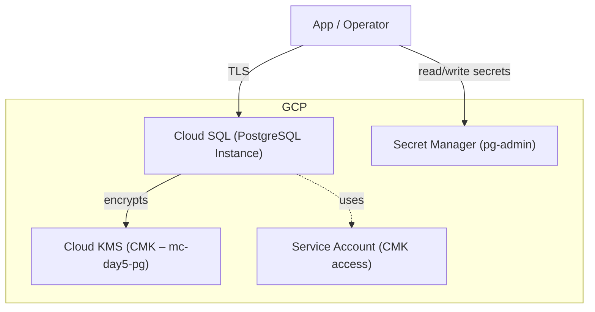

# 🟨 GCP Day 5 — Cloud SQL (PostgreSQL) + Cloud KMS CMK + Secret Manager

**Goal:**  
Use a **Cloud KMS customer-managed key (CMK)** to encrypt a **Cloud SQL (PostgreSQL)** instance and store its admin credentials securely in **Secret Manager**.

---

## 🧠 Concept

- **Cloud KMS (CMK):** encrypts the storage and backups of your Cloud SQL instance.  
- **Cloud SQL (PostgreSQL):** the managed database service.  
- **Secret Manager:** stores and rotates the database admin password.  
- **Service Account:** grants Cloud SQL permission to use the KMS key.

---

## 🧱 Architecture Diagram

pgsql
Copy code

---

## 🚀 Quickstart (Terraform)

> Folder: `gcp/day5/iac/terraform`

**What it deploys**
- A Cloud KMS key ring and RSA key  
- Service account with KMS CryptoKey Encrypter/Decrypter role  
- Cloud SQL (PostgreSQL) instance encrypted with the CMK  
- Secret Manager secret `pg-admin` holding the database password

**Run:**
```bash
cd ~/multi-cloud-kms-lab/gcp/day5/iac/terraform
terraform init
terraform apply -auto-approve
✅ Verify Encryption and Secrets
bash
Copy code
# Get KMS key ID
gcloud kms keys list --keyring=mc-day5 --location=us-central1

# Check database encryption metadata
gcloud sql instances describe mc-day5-pg --format="value(diskEncryptionConfiguration.kmsKeyName)"

# Fetch the stored admin password
gcloud secrets versions access latest --secret="pg-admin"
🧹 Cleanup (to avoid charges)
bash
Copy code
cd ~/multi-cloud-kms-lab/gcp/day5/iac/terraform
terraform destroy -auto-approve
If destroy fails due to key dependencies, delete the Cloud SQL instance first, then rerun destroy.

📁 Where Things Live
Terraform: gcp/day5/iac/terraform

README: gcp/day5/README.md

Multi-Cloud Overview: common/day5-databases/README.md
